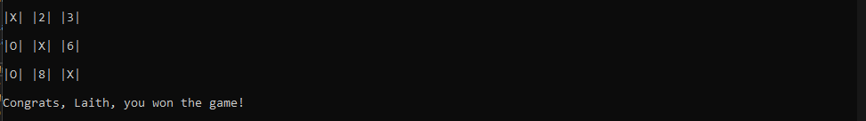

# Lab-04---Classes-Objects-tic-tac-toe-

## Problem Domain
Create a two (2) person,Tic-Tac-Toe program which takes turns between the two players in order to play the game.
Prompts to enter two user names. The game will begin with player one (assigned X) choosing a number on the game board. Next, player two (assigned O) will choose an available number on the board. Continue until there is a winner or until there is a draw.

## Visuals

## 1. Game start:

## 2. Enter in the names for each player:

## 3. Game Over!

